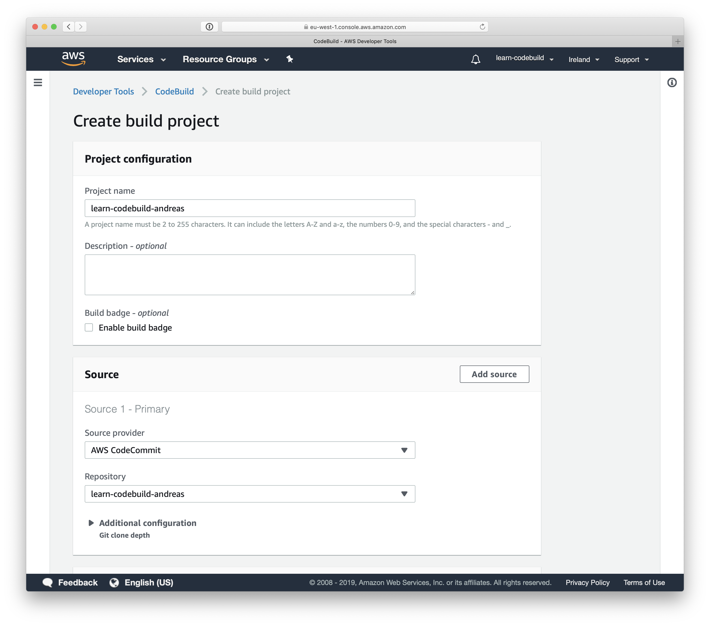
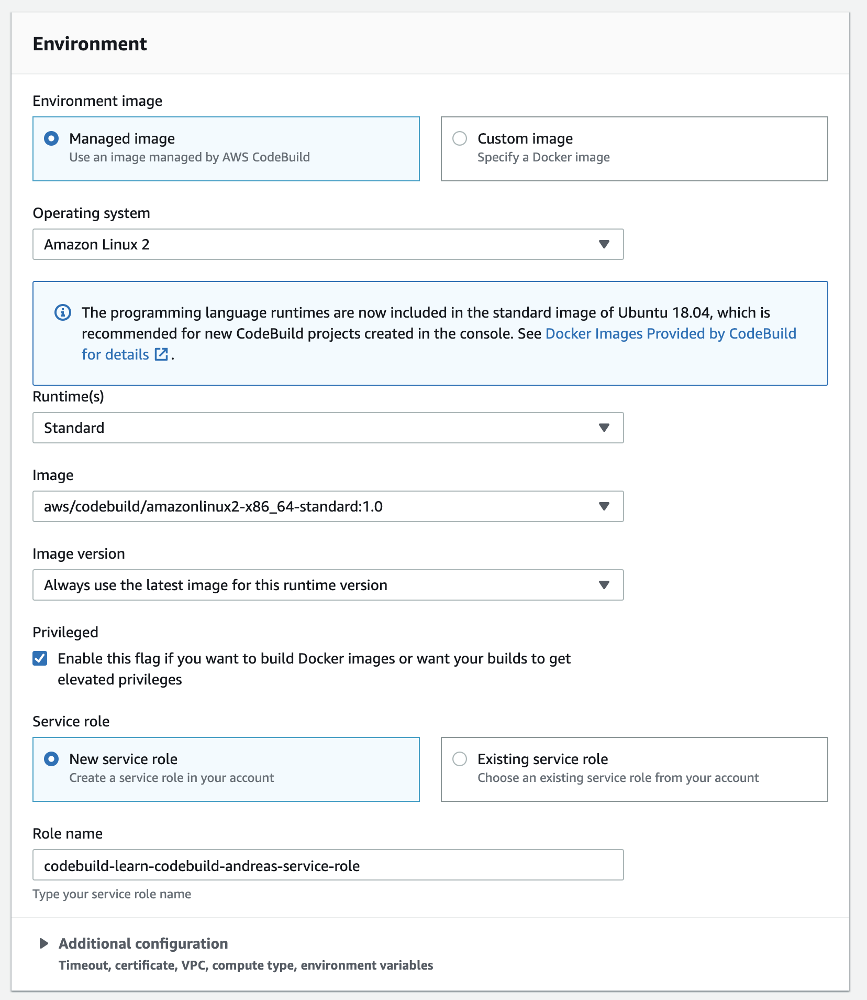

# Lab 01: Build and push a Docker image with CodeBuild

## Goal

Use CodeBuild to build a Docker image including a web server and static web content files. Push the Docker image to ECR (Elastic Container Registry).

## Instructions

Before you start note that the repository already includes a `Dockerfile` including the instructions needed to build the Docker image. Also the folder `html` contains a simple static website.

### Creating a CodeBuild project

1. Open the AWS Management Console and jump to the service CodeBuild.
1. Click the `Create project` or `Create build project` button.

As shown in the following figure fill out the following parameters and keep the defaults for the rest.

1. Type in `learn-codebuild-$user` for the project name. Replace `$user` with your name (e.g. `andreas`).
1. Choose `AWS CodeCommit` as source provider.
1. Select your repository (e.g. learn-codebuild-andreas).



Next you need to configure the environment for the project as shown in the following figure.

1. Choose the Environment image `Managed image`.
1. Select the operating system `Ubuntu`.
1. Choose the `Docker` runtime.
1. Choose the latest runtime version.
1. Select `New service role` and keep the generated role name.



Finally choose `Use a buildspec file` and keep the defaults for the remaining parameters as shown in the following figure.

Click the `Create build project` button.


You have successfully created your first CodeBuild project. Before you press the `Start build` button you need to create a `buildspec.yml` file containing the build phases and commands first.

### Configuring the build phases and commands

Make sure you are starting from the starting point for Lab 01.

```
cp lab01-codebuild-ecr/starting-point/buildspec.yml buildspec.yml
```

Extend the `buildspec.yml` with two phases: build and post build.

Use the following command to build the Docker image. Find a way to replace `$version` with the commit hash from CodeCommit.

```
docker build -t learn-codebuild:$version .
```

The following commands are needed to tag and push the Docker image to your ECR repository. Make sure to replace `$version` in the same way as you have done in the previous step.

```
$(aws ecr get-login --no-include-email --region eu-west-1)
docker tag learn-codebuild:$version 486555357186.dkr.ecr.eu-west-1.amazonaws.com/learn-codebuild-andreas:$version
docker push 486555357186.dkr.ecr.eu-west-1.amazonaws.com/learn-codebuild-andreas:$version
```

After modifying the `buildspec.yml` file you need to commit and push your changes to the `deploy` origin.

```
git add .
git commit -m "lab 01"
git push deploy master
```

Switch back to the AWS Management Console.

Before you proceed you need to grant access your CodeBuild project access to your ECR repository.

1. Go to Identity and Access Management (IAM).
1. Search for an IAM role named `codebuild-learn-codebuild-$user-service-role`.
1. Attach the managed IAM polcy named `AmazonEC2ContainerRegistryPowerUser` to the IAM role.

The following steps guide you through starting your first build.

1. Open your CodeBuild project.
1. Press the `Start build` button.
1. Watch the build logs and verify that a Docker image shows up in your ECR registry.

Congratulations, you have successfully set up a job building and publishing a Docker image by using CodeBuild.

Learn how to integrate CodeBuild with CodePipeline in the following lab.

## Help

* [Build Specification Reference for AWS CodeBuild](https://docs.aws.amazon.com/codebuild/latest/userguide/build-spec-ref.html)
* [Environment Variables in Build Environments](https://docs.aws.amazon.com/codebuild/latest/userguide/build-env-ref-env-vars.html)
