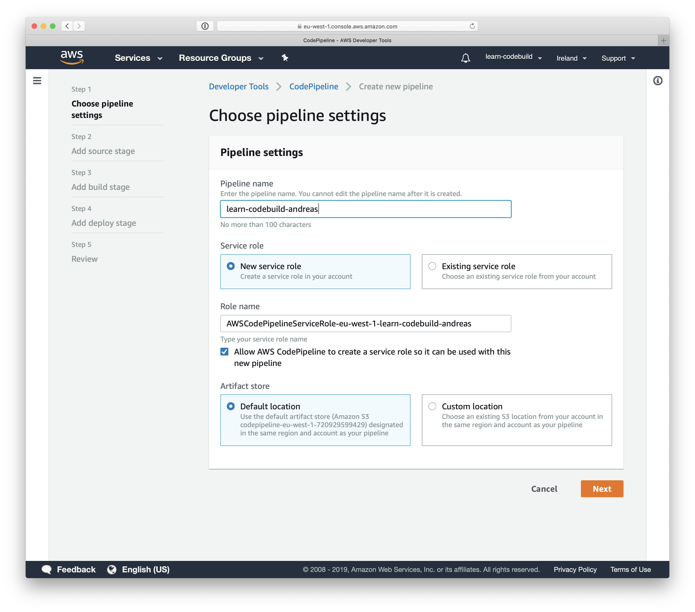
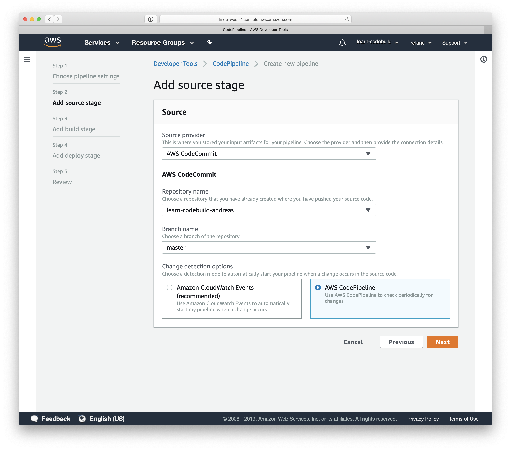
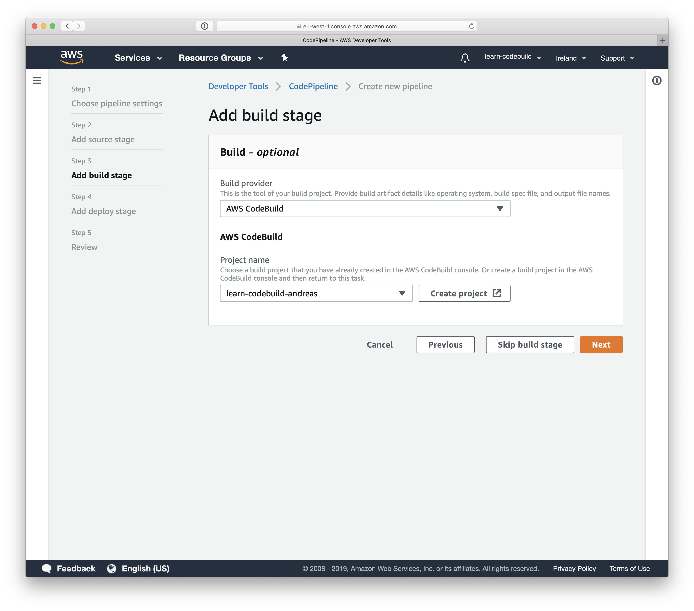
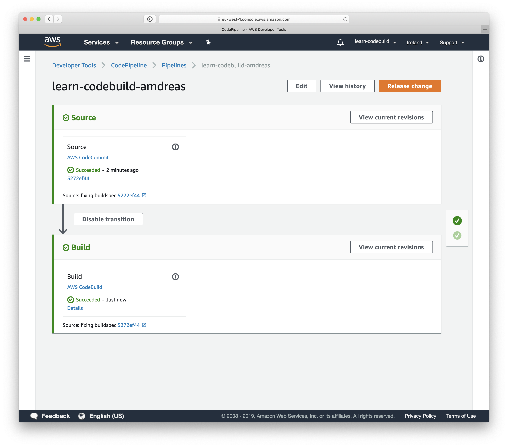

# Lab 02: Integrate CodeBuild into CodePipeline

## Goal

Create a deployment pipeline with CodePipeline which is triggered by changes to CodeCommit and starts a build of your CodeBuild project automatically.

## Instructions

1. Open the AWS Management Console and jump to the service CodePipeline.
1. Click the `Create pipeline` button.

As shown in the following figure fill out the mentioned parameters and keep the defaults for the rest.

1. Type in `learn-codebuild-$user` for the pipeline name. Replace `$user` with your name (e.g. `andreas`).
1. Select `New service role` and keep the generated role name.
1. Proceed with the next step by clicking the `Next` button.

Next, you need to configure the source action as illustrated in the following figure.

1. Select source provider `AWS CodeCommit`.
1. Choose your repository named `learn-codebuild-$user`.
1. Choose the branch name `master`.
1. Select `AWS CodePipeline` as the change detection option.
1. Proceed with the next step by clicking the `Next` button.

This step shown in the following figure is about integrating your CodeBuild project into the pipeline.

1. Select build provider `AWS CodeBuild`.
1. Choose your CodeBuild project `learn-codebuild-$user`.
1. Proceed with the next step by clicking the `Next` button.

Skip the `deploy stage` step. Review your pipeline configuration and click the `Create pipeline` button.

Great, you have created your CodePipeline. After a few seconds your pipeline will be started for the first time automatically.

Wait for the pipeline to finish.

Congratulations, you have successfully integrated CodeBuild with CodePipeline.

Please don't forget to [clean up](..) your AWS account.

## Help

* [AWS CodePipeline User Guide](https://docs.aws.amazon.com/codepipeline/latest/userguide/welcome.html)
